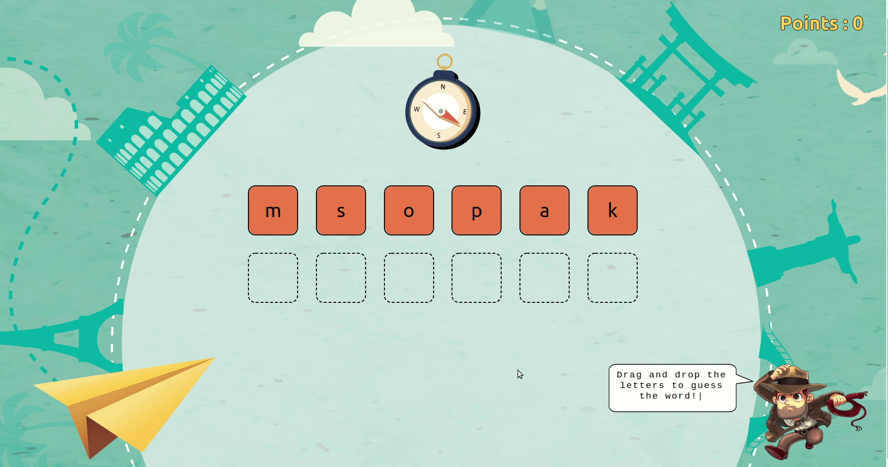

# Travel game

## ✈️ [Check out the demo here](#Demo)✈️

## Table of contents

- [Preface](#Preface)
- [Demo](#Demo)
- [How to start](#How-to-start)
- [Technologies used for this project](#Technologies-used-for-this-project)

## Preface

This project was build in week 10 of the Codaisseur bootcamp. The goal was to build an app in 4 days with a technology we didn't learn before. This app is made for childeren who want to learn the Dutch language in a playfull way, by dragging letters into the right place and guessing the word. React-dnd is used as the "new technology" to make it possible to drag and drop elements.

## Demo

## How to start

1. Clone the git repository into a new directory on your computer using the following command: `git clone git@github.com:cynthiameiring/Drag-n-drop-travel-game.git`
2. Run `npm install` in your terminal to install all the dependencies
3. Run `npm run start` to start the app locally on your computer

## Technologies used for this project

- React with `create-react-app`
- Redux as a state manager
- `react-dnd`: a library to drag and drop elements
- `react-typist` for a typing effect in the text balloon
- `uifx` for the sound effect
